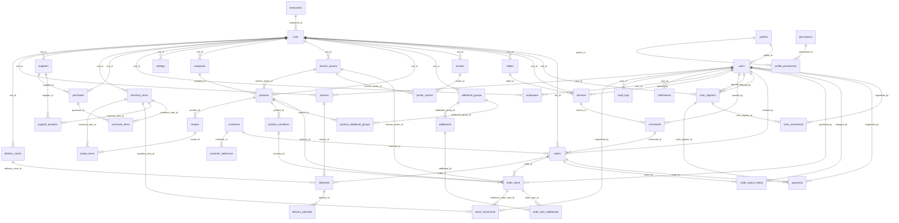

# DER (gerado das migrations V1–V15)

43 tabelas, 71 chaves estrangeiras. Renderiza no GitHub, VS Code (Mermaid) e Obsidian.

```mermaid
erDiagram
    units ||--o{ delivery_zones : "unit_id"
    units ||--o{ couriers : "unit_id"
    users ||--o{ couriers : "user_id"
    orders ||--o{ deliveries : "order_id"
    couriers ||--o{ deliveries : "courier_id"
    delivery_zones ||--o{ deliveries : "delivery_zone_id"
    deliveries ||--o{ delivery_attempts : "delivery_id"
    units ||--o{ suppliers : "unit_id"
    units ||--o{ inventory_items : "unit_id"
    products ||--o{ recipes : "product_id"
    recipes ||--o{ recipe_items : "recipe_id"
    inventory_items ||--o{ recipe_items : "inventory_item_id"
    inventory_items ||--o{ stock_movements : "inventory_item_id"
    order_items ||--o{ stock_movements : "reference_order_item_id"
    users ||--o{ stock_movements : "registered_by"
    units ||--o{ purchases : "unit_id"
    suppliers ||--o{ purchases : "supplier_id"
    users ||--o{ audit_logs : "user_id"
    users ||--o{ notifications : "user_id"
    suppliers ||--o{ supplier_products : "supplier_id"
    inventory_items ||--o{ supplier_products : "inventory_item_id"
    purchases ||--o{ purchase_items : "purchase_id"
    inventory_items ||--o{ purchase_items : "inventory_item_id"
    profiles ||--o{ profile_permissions : "profile_id"
    permissions ||--o{ profile_permissions : "permission_id"
    profiles ||--o{ users : "profile_id"
    restaurants ||--o{ units : "restaurant_id"
    users ||--o{ employees : "user_id"
    units ||--o{ employees : "unit_id"
    units ||--o{ settings : "unit_id"
    units ||--o{ categories : "unit_id"
    units ||--o{ kitchen_sectors : "unit_id"
    units ||--o{ products : "unit_id"
    categories ||--o{ products : "category_id"
    kitchen_sectors ||--o{ products : "kitchen_sector_id"
    products ||--o{ product_variations : "product_id"
    units ||--o{ additional_groups : "unit_id"
    additional_groups ||--o{ additionals : "additional_group_id"
    products ||--o{ product_additional_groups : "product_id"
    additional_groups ||--o{ product_additional_groups : "additional_group_id"
    units ||--o{ printers : "unit_id"
    printers ||--o{ printer_sectors : "printer_id"
    kitchen_sectors ||--o{ printer_sectors : "kitchen_sector_id"
    customers ||--o{ customer_addresses : "customer_id"
    units ||--o{ tables : "unit_id"
    units ||--o{ services : "unit_id"
    tables ||--o{ services : "table_id"
    users ||--o{ services : "opened_by"
    services ||--o{ commands : "service_id"
    users ||--o{ commands : "opened_by"
    units ||--o{ cash_registers : "unit_id"
    users ||--o{ cash_registers : "opened_by"
    users ||--o{ cash_registers : "closed_by"
    units ||--o{ orders : "unit_id"
    commands ||--o{ orders : "command_id"
    customers ||--o{ orders : "customer_id"
    users ||--o{ orders : "created_by"
    orders ||--o{ order_items : "order_id"
    products ||--o{ order_items : "product_id"
    product_variations ||--o{ order_items : "variation_id"
    kitchen_sectors ||--o{ order_items : "kitchen_sector_id"
    users ||--o{ order_items : "produced_by"
    order_items ||--o{ order_item_additionals : "order_item_id"
    additionals ||--o{ order_item_additionals : "additional_id"
    orders ||--o{ order_status_history : "order_id"
    users ||--o{ order_status_history : "changed_by"
    orders ||--o{ payments : "order_id"
    users ||--o{ payments : "registered_by"
    cash_registers ||--o{ payments : "cash_register_id"
    cash_registers ||--o{ cash_movements : "cash_register_id"
    users ||--o{ cash_movements : "registered_by"
```
